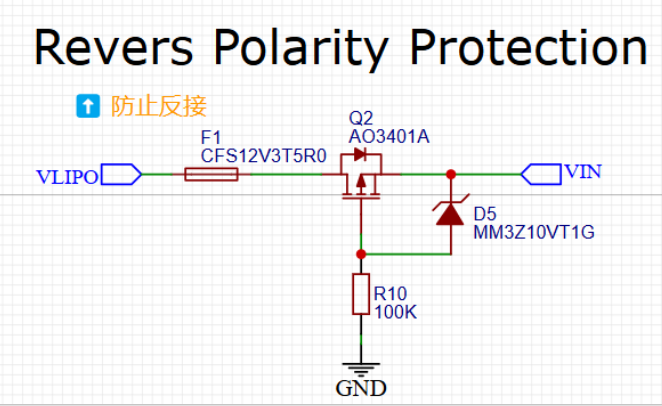

此部分记录一些收集的或者验证过的电源电路，如 Buck 电路、LDO 电路，如果可能， 尽量在每种电路下提供清楚 bom，以及负载能力。

## 防止正负极反接

### **P-mos 防止电路反接**

电池+接 vlipo，电池-接 GND，此时 pmos 导通，电流从 vlipo 流入“vin”，“vin”用于后边各变压电路的电源输入；当电池反接时，电池-接 vlipo、电池+接 GND 时，pmos 不导通，无法形成闭环。

## 5V 供电

## 3V 供电
